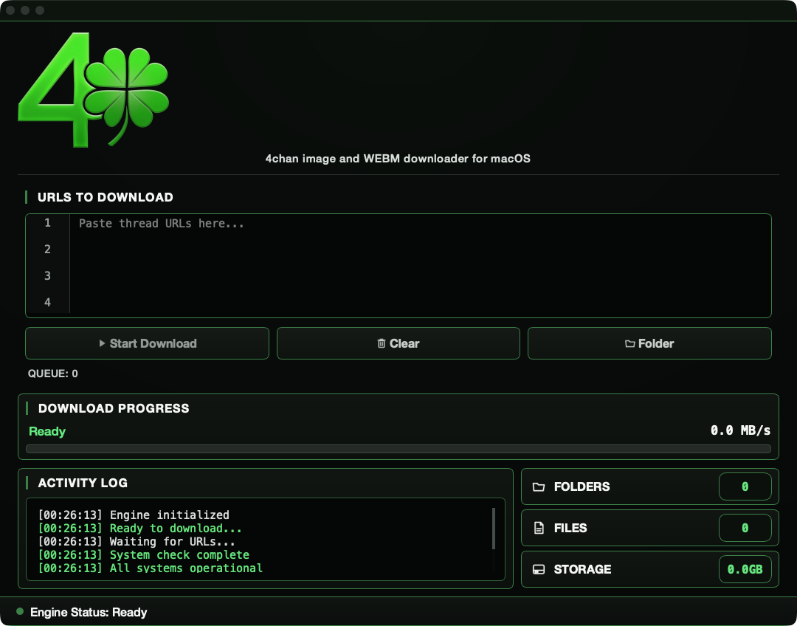

# 4Charm

<p align="center">

[](https://github.com/RazorBackRoar/4Charm/releases/latest)
[](https://github.com/RazorBackRoar/4Charm/actions/workflows/ci.yml)
[](LICENSE)
[](https://www.python.org/)
[](https://doc.qt.io/qtforpython/)
[](https://support.apple.com/en-us/HT211814)

</p>

**Native macOS downloader for public 4chan threads, catalogs, and boards.**

Queue work, keep a folder layout, resume after a drop, and skip files you already have.

<p align="center">
  <a href="https://github.com/RazorBackRoar/4Charm/releases/latest/download/4Charm.dmg"><strong>Download 4Charm.dmg</strong></a>
  ·
  <a href="https://github.com/RazorBackRoar/4Charm/releases">All releases</a>
</p>



## Features

- Queue up to 50 threads or catalogs at once
- Folder layout with WEBM files kept separate
- Resume interrupted downloads
- SHA-256 dedup so the same file is not fetched twice
- Adaptive rate limiting and backoff
- MD5 checks on completed files
- Redirects stay on 4chan and 4cdn hosts
- Live progress, bandwidth, and ETA
- Apple Silicon (arm64) build

## Install

macOS 12 or later on Apple Silicon. The packaged app does not need Python.

1. Download [`4Charm.dmg`](https://github.com/RazorBackRoar/4Charm/releases/latest/download/4Charm.dmg)
2. Open the DMG and drag `4Charm.app` to `/Applications`
3. First launch: right-click the app and choose **Open** (ad-hoc signed build)

## Usage

1. Paste a thread, catalog, or board URL
2. Start the download and watch the log
3. Files land in the folder you picked, already sorted

## Disclaimer

4Charm downloads media from public 4chan threads and boards. It is not affiliated with or endorsed by 4chan. You are responsible for following 4chan's rules, copyright law, and the law where you live.

## Development

```bash
git clone https://github.com/RazorBackRoar/4Charm.git
cd 4Charm
uv sync
uv run python -m four_charm.main
```

```bash
uv run ruff check .
uv run ty check src --python-version 3.14
uv run pytest tests/ -q
razorbuild 4Charm
```

`razorbuild` writes `dist/4Charm.dmg`.

## Docs

- [Architecture](docs/ARCHITECTURE.md)
- [Build and release](BUILD_AND_RELEASE.md)
- [Contributing](CONTRIBUTING.md)
- [Security](SECURITY.md)
- [Code of conduct](CODE_OF_CONDUCT.md)

## License

MIT License. See [LICENSE](LICENSE).

Copyright © 2026 RazorBackRoar

If you need me, give me a holler.

<!-- razorcore:runtime:start -->
## Runtime Requirements

For users:
- Download the macOS `.dmg` or `.app` release. Python does not need to be installed.

For developers:
- Primary development/build target: Python 3.14 with `uv`.
- Source/build target: Python 3.14 only.
- Setup: `uv sync`
- Run: `uv run python -m four_charm.main`
<!-- razorcore:runtime:end -->
